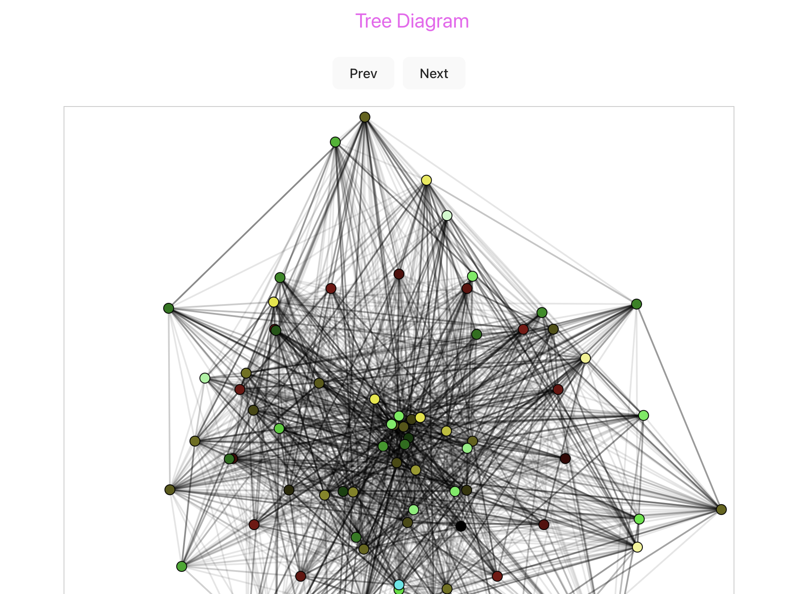
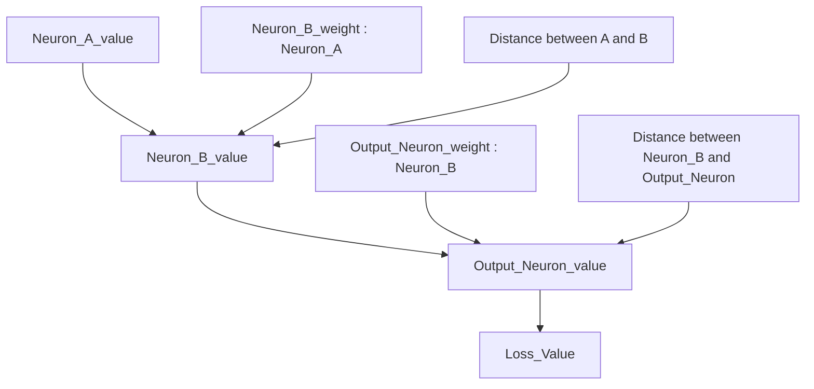
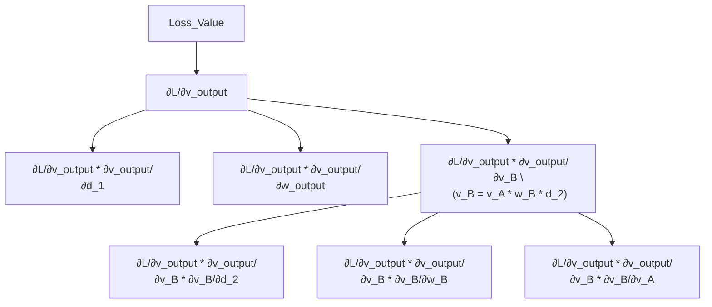

# Email-Classifier-AI React App

## Description
- This project implements a custom neuron-style email classification system designed by me.  
- Emails are vectorized using a TF-IDF vectorizer, and the network classifies them based on **weights** and a **distance-based factor**.  
  The model is trained using **backpropagation** to minimize the **Mean Squared Error (MSE)**.  
  All rules and computations are implemented in `src/system.py`.
- The frontend is built with React. To view the web interface, navigate to the `react-app` directory and start the development server.

## Demo


## Project Structure
```
Email-Classifier-AI/
├─ README.md
├─ demo
|  └─ image.png
├─ data/
│  ├─ raw/                          # Raw email dataset
│  └─ processed/                    # The vectorized data is loaded into CSV files
├─ notebooks/
│  ├─ 01_data_analysis.ipynb
│  ├─ 02_feature_extraction.ipynb
│  └─ 03_model_training.ipynb
├─ src/                             # Root directory of the backend
│  ├─ preprocess.py                 # Data preprocessing
│  ├─ train.py                      # Run it for training
│  ├─ predict.py                    # Used for prediction
│  ├─ evaluate.py                   # Used to determine error
|  ├─ config.py                     # Operating parameters
|  ├─ system.py                     # Core classification logic
|  ├─ snapshots.py                  # Save neurons as .json files
|  ├─ train.log                     # Record training loss
│  └─ tfidf_vectorizer.pkl          # Obtain email features
|                                     Ensure that the same set of rules is used to get email 
|                                     features each time (It can be delete)
├─ react-app/                       # Root directory of the React frontend
|  ├─ src
|  |  ├─ App.css                    # Stylesheet for the web-app
|  |  └─ App.tsx                    # Main React component of the app
│  └─ public/
|     └─snapshots/                  # Stores JSON data generated by the backend for frontend
|                                     (It is best to clear .json files in the folder before
|                                     running the code)
|
├─ outputs/
│  ├─ metrics.png              
│  └─ examples.md
├─ requirements.txt
└─ LICENSE
```

## Tech Stack
- React
- Vite
- TypeScript
- CSS
- Machine Learning API

## Getting Started
1. Prepare the email dataset  
    Place your email data in the `data/raw-data` directory.  
    Each email file name should consist of two parts:  
    **email category** and **email ID**.
    - *Example*:
        - *spam_001.txt*
    
2. After preparing the dataset, run the preprocessing script:
    ```bash
    cd src
    python preprocess.py
    ```

3. Configure parameters  
    Modify the configuration parameters in `src/config.py` as needed.

4. Train the model  
    Navigate to the `src` directory and run the training script:
    ```bash
    cd src
    python train.py
    ```

5. After training, .json files will be generated in `react-app/public/snapshots`.

6. Run the frontend
    Navigate to the `react-app` directory and start the development server:
    ```cd react-app
    npm run dev -- --host 0.0.0.0
    ```

7. View the result
    The terminal will display a local website URL.
    Open it in your browser to view the visualized results.

## Algorithm Overview
The email data is vectorized using built-in Python methods.  
Each email is represented as a numerical vector before classification.

`Weights` are used as parameters multiplied during the computation between neurons, representing the relative influence of each connection.  
`A distance-based factor` is introduced as `1 / (1 + d)`, which is multiplied with the value to adjust the output.

The classification result is determined by the output neuron value. Different output ranges correspond to different email categories:

- `0.0` → spam  
- `0.2` → maybe spam  
- `0.5` → uncertain  
- `0.8` → maybe ham  
- `1.0` → ham  

The final output value falls within different intervals
On the test dataset, the model achieves a test error of **0.0772**, measured using **Mean Squared Error (MSE)**. Further improvements in email feature representation can significantly reduce the classification error.

# Graph for Algorithm
- Forward Propagation

- Backward Propagation
